# BuyTheTop

> A premium ranking platform where monetary contributions decide your place on
> the leaderboard. Pay more, climb higher, claim the throne.

BuyTheTop is a Next.js 15 application that turns a simple idea — *"buy your
way to the top"* — into a polished, production-grade product, complete with
Stripe payments, Supabase auth, role-based admin panel, transactional emails,
audit logging and a fully responsive UI.

This repository is a snapshot of the live project at
[buythetop.vip](https://buythetop.vip). The original Supabase project is
currently paused, so the repo ships with a complete SQL schema and a
synthetic seed (50 users, 79 payments, a rich position history) that lets
anyone bring up a working copy in a few minutes.

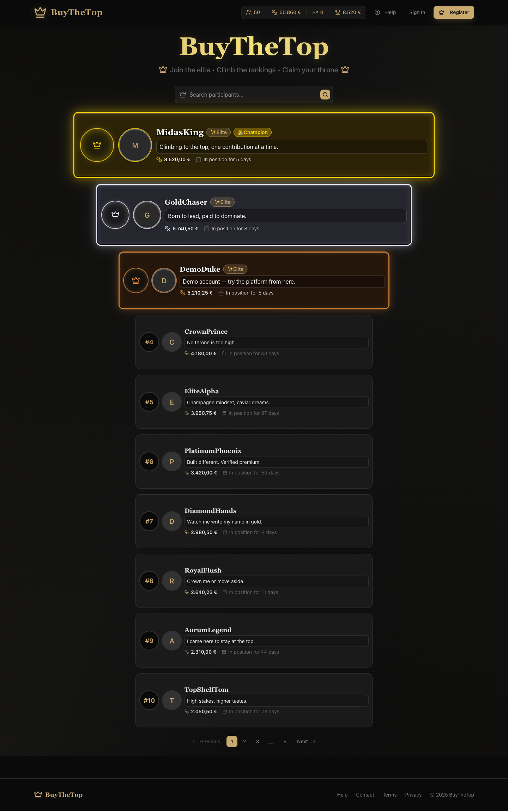

---

## Table of Contents

- [Highlights](#highlights)
- [Tech stack](#tech-stack)
- [Getting started](#getting-started)
- [What's inside](#whats-inside)
  - [Leaderboard (Home)](#leaderboard-home)
  - [Authentication](#authentication)
  - [User profile](#user-profile)
  - [Contribute & payments](#contribute--payments)
  - [Payment success](#payment-success)
  - [Admin moderation panel](#admin-moderation-panel)
  - [Help, search & mobile](#help-search--mobile)
- [Database schema](#database-schema)
- [Project structure](#project-structure)
- [Deployment](#deployment)
- [License](#license)

---

## Highlights

- **Real-money leaderboard** — Stripe Checkout (hosted), webhook-driven
  position recalculation, server-validated payment intents and idempotent
  ranking updates.
- **End-to-end auth** with Supabase: email/password, password reset, email
  change with confirmation, role-based access (`user` / `admin`).
- **Server-side rendered rankings** (`revalidate = 0`) with paginated
  search, podium styling for the top 3 and per-row position history.
- **Admin moderation panel** — stats dashboard, user management with avatar
  + bio editing, position management and audit-log gated by RLS.
- **Transactional emails** via Resend (welcome, password reset, position-
  overtaken notifications) with templated HTML.
- **Position notifications** — when someone overtakes you, an email goes out
  (toggleable per user from the profile).
- **Audit logging** — every login, payment, admin action and rate-limit hit
  flows into an `audit_logs` table protected by an `admin`-only RLS policy.
- **Production hardening**: CSP/security headers, CSRF tokens for mutating
  routes, rate limiting, content filtering, server-side image compression.
- **Edge-ready** — runs as Next.js Edge runtime, deployed on Cloudflare Pages
  with `@cloudflare/next-on-pages`.
- **Analytics** — GTM, Google Analytics 4 and Meta Pixel, with a custom
  cookie consent banner gating non-essential tracking.

## Tech stack

| Layer        | Tech                                                                 |
|--------------|----------------------------------------------------------------------|
| Framework    | Next.js 15 (App Router, Edge runtime) · React 19 · TypeScript        |
| UI           | Tailwind CSS 4 · shadcn/ui (Radix) · lucide-react · sonner           |
| Auth & DB    | Supabase (Postgres 17 + GoTrue + Storage) · RLS policies             |
| Payments     | Stripe Checkout (hosted) · webhooks with signature verification      |
| Email        | Resend · `@react-email/render` templates                             |
| Validation   | Zod · `react-hook-form`                                              |
| Hosting      | Cloudflare Pages (`@cloudflare/next-on-pages`) · Wrangler            |

## Getting started

### Prerequisites

- Node.js 20+ and **pnpm** 9+
- A Supabase project (cloud or local via [Supabase CLI](https://supabase.com/docs/guides/cli))
- A Stripe account (test mode is enough)
- *(Optional)* A Resend API key — without it the app runs, but emails won't send

### 1. Clone and install

```bash
git clone https://github.com/i12gocaj/BuyTheTop.git
cd BuyTheTop
pnpm install
```

### 2. Set up the database

The cleanest path is the Supabase CLI with Docker running:

```bash
supabase start                    # boots Postgres + GoTrue + Studio
supabase db reset                 # applies migrations + seed
```

This applies [`supabase/migrations/20260101000000_initial_schema.sql`](supabase/migrations/20260101000000_initial_schema.sql)
and then runs [`supabase/seed.sql`](supabase/seed.sql), which inserts:

- 50 ranked users with realistic display names and bios
- ~79 payment records distributed over the last 4 months
- A position history that traces the demo user's climb from #32 to #3
- An `admin` user and a `demo` user you can log in as

| Email                    | Password     | Role  | Position |
|--------------------------|--------------|-------|----------|
| `admin@buythetop.demo`   | `Admin1234!` | admin | mid-pack |
| `demo@buythetop.demo`    | `Demo1234!`  | user  | #3       |

> **Cloud Supabase**: open the SQL editor, paste
> [`supabase/schema.sql`](supabase/schema.sql) and run it, then paste
> [`supabase/seed.sql`](supabase/seed.sql).

### 3. Configure environment

```bash
cp .env.example .env.local
```

Then fill in the values. For a local Supabase + test Stripe setup, the
relevant ones are:

```env
NEXT_PUBLIC_SUPABASE_URL=http://127.0.0.1:54321
NEXT_PUBLIC_SUPABASE_ANON_KEY=<from `supabase status`>
SUPABASE_SERVICE_ROLE_KEY=<from `supabase status`>

STRIPE_SECRET_KEY=sk_test_...
NEXT_PUBLIC_STRIPE_PUBLISHABLE_KEY=pk_test_...
STRIPE_WEBHOOK_SECRET=whsec_...   # from `stripe listen --forward-to localhost:3000/api/webhooks/stripe`
```

### 4. Run it

```bash
pnpm dev
```

Open [http://localhost:3000](http://localhost:3000) and either browse the
leaderboard or log in as the demo user.

---

## What's inside

### Leaderboard (Home)

Server-rendered ranking with a gilded podium for #1–#3, paginated by 10
entries, with debounced search across display name and bio. The header shows
live aggregate stats (total contributors, total raised) and adapts to the
viewer's auth state.


Search filters across display name and bio, with a no-results state when the
query doesn't match:

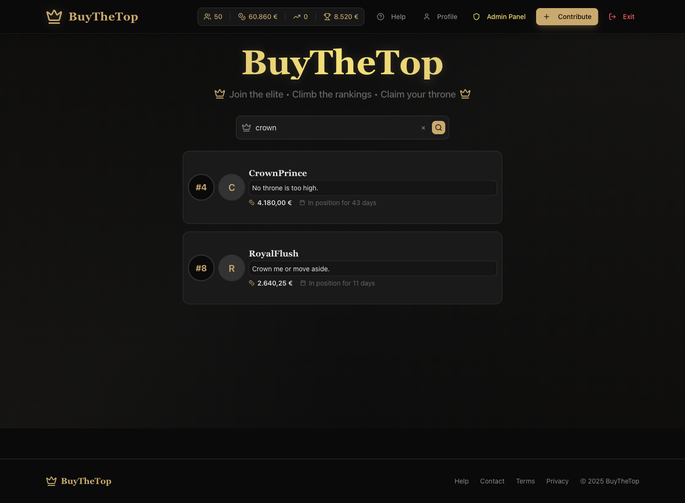

### Authentication

Email/password flow on top of Supabase Auth. Standalone screens for sign-up
and sign-in, plus forgot-password and reset flows. Errors are surfaced via
toasts and inline messages; passwords have visibility toggles.

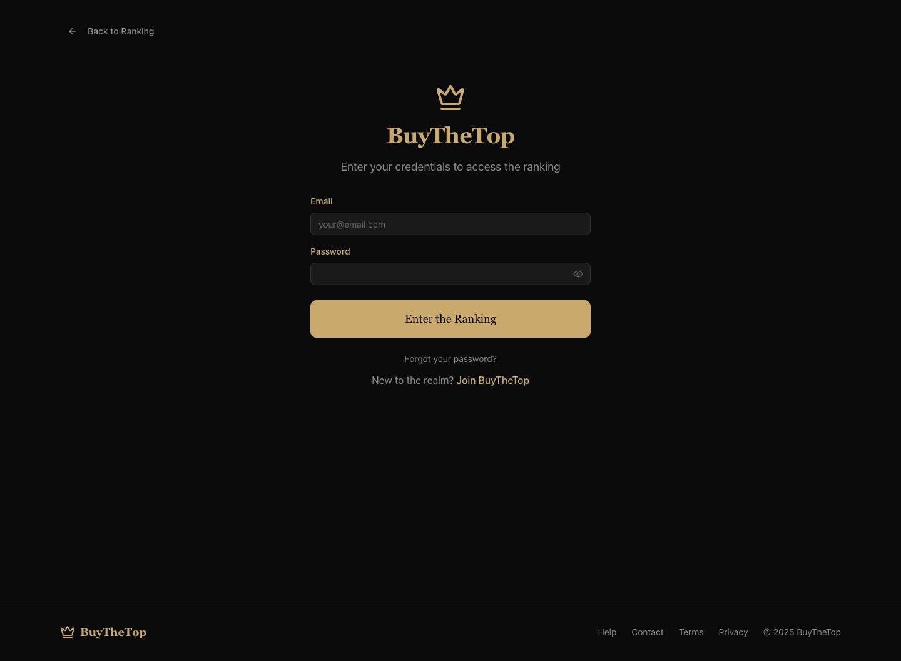

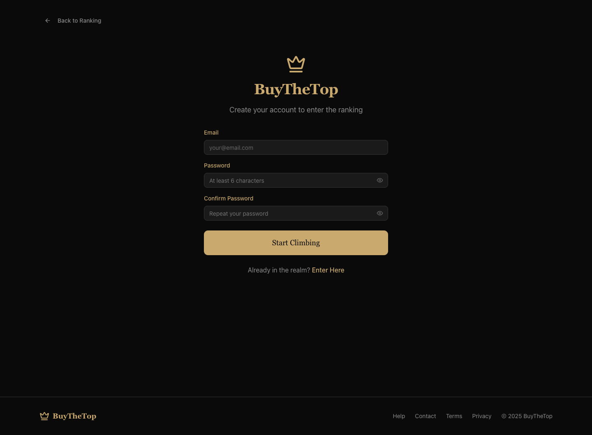

### User profile

Everything a user needs to manage their presence: avatar upload (with
client-side image compression), display name, bio, email change with
confirmation, position-overtaken email opt-out, payment history and a
chronological position history. The "Position Status" card highlights who
you'd need to overtake next and offers a one-click jump to Contribute.

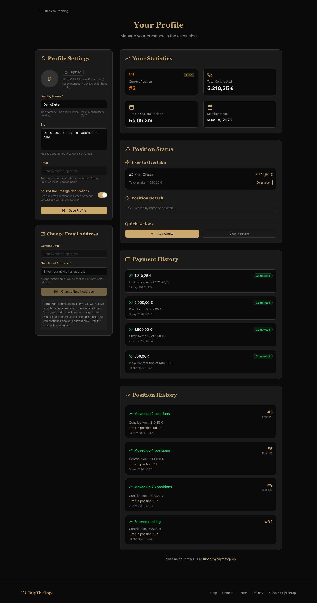

### Contribute & payments

The Contribute page projects your new total and the resulting position
*before* you pay. Quick-amount chips, a custom amount field and the current
top 5 are shown side-by-side. Tap "Proceed to Payment" and you're redirected
to Stripe-hosted checkout; on success Stripe webhooks update the ranking and
write a `position_history` row.

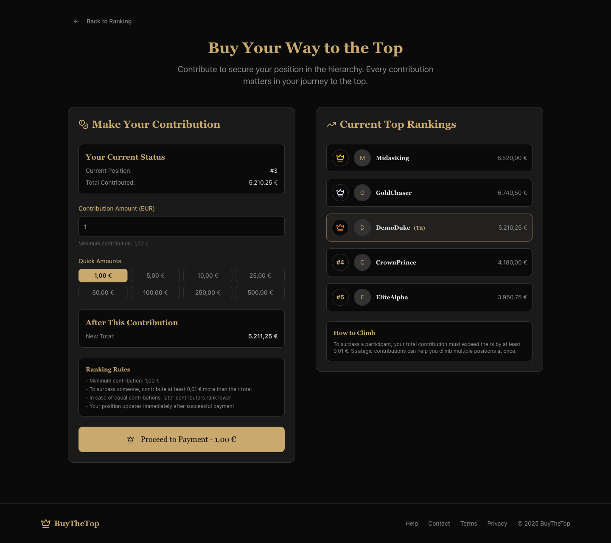

### Payment success

A clean confirmation screen with the contribution amount, Stripe session ID
and CTAs back to the ranking and to your profile. Purchase events are
forwarded to GA4 and Meta Pixel for campaign attribution.

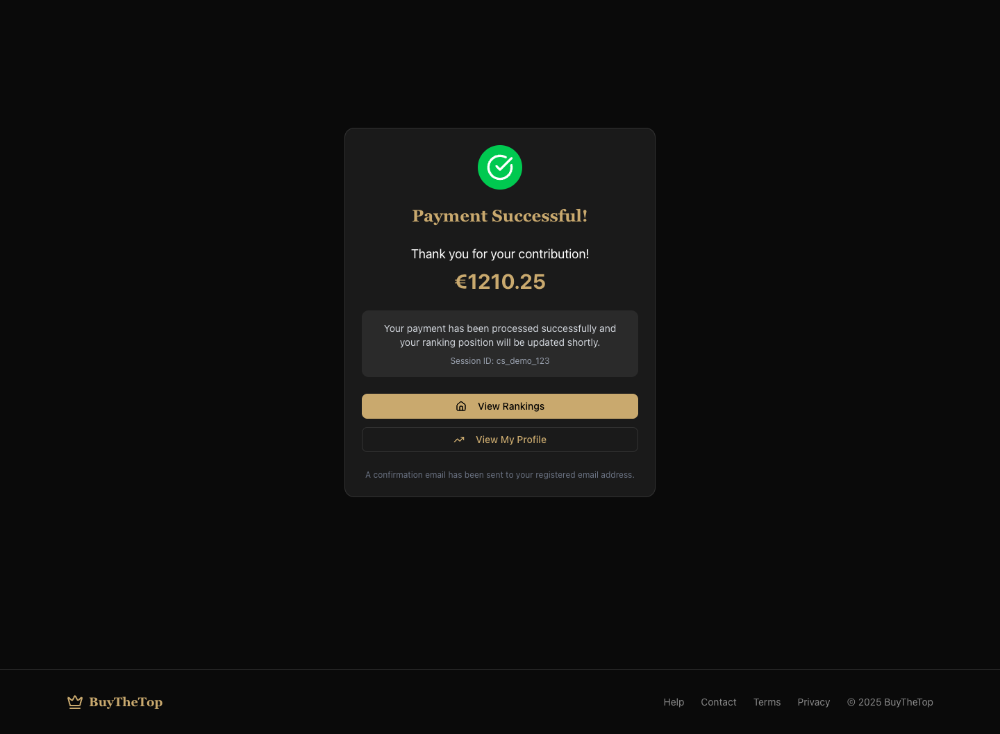

### Admin moderation panel

Gated by the `role = 'admin'` column on `user_profiles` and enforced both
client-side (redirect) and server-side (RLS + middleware).

Statistics tab — live counts of users, positions, admins and confirmed
accounts:

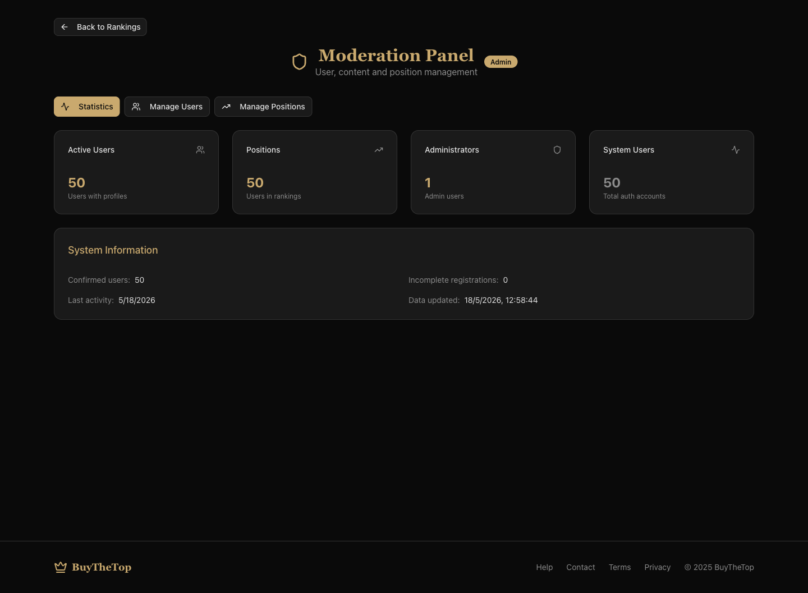

Manage Users — search, edit display name and bio, manage avatars:

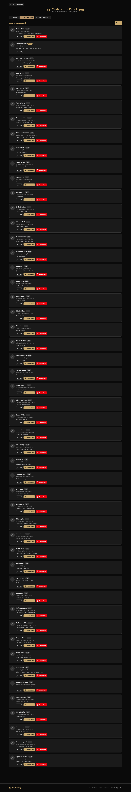

Manage Positions — full ranking sorted by contribution, with the days-in-
position calculated against `position_acquired_at`:

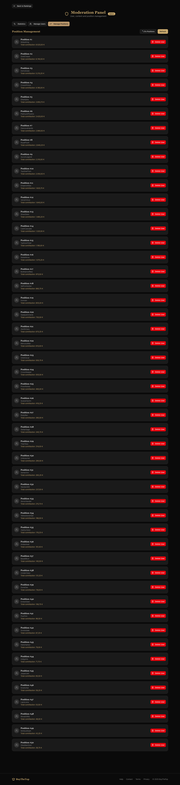

### Help, search & mobile

A static Help page documents how the ranking math works, how to contribute
and account management. The whole app is mobile-first; the home view stacks
the podium and switches to a compact stats bar on small screens.

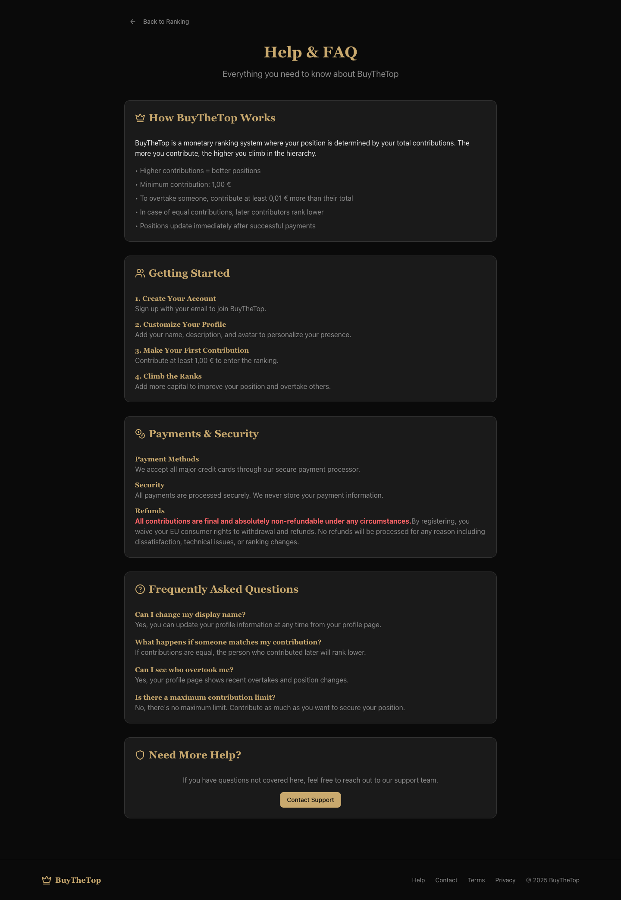

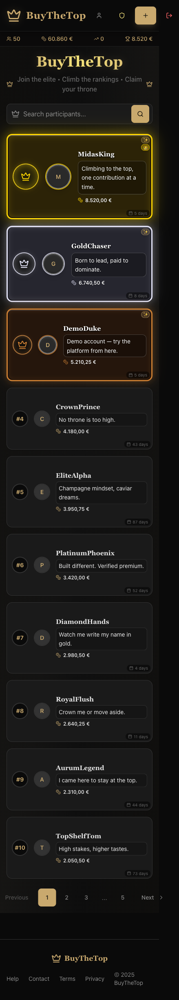

---

## Database schema

Five tables in the `public` schema, all with RLS enabled:

| Table              | Purpose                                                                 |
|--------------------|-------------------------------------------------------------------------|
| `user_profiles`    | One-to-one with `auth.users`. Display name, bio, avatar, role, email-opt-in |
| `rankings`         | Each user's `total_contribution`, `current_position`, `position_acquired_at` |
| `payments`         | Stripe payment records. Indexed by `payment_intent_id` for idempotency  |
| `position_history` | Append-only log of position changes, with old/new pos and amount        |
| `audit_logs`       | Admin-readable activity log (`LOGIN`, `PAYMENT_COMPLETED`, etc.)        |

Full DDL: [`supabase/schema.sql`](supabase/schema.sql).
Synthetic data: [`supabase/seed.sql`](supabase/seed.sql).

## Project structure

```
.
├── app/                    # Next.js App Router
│   ├── admin/              # Admin moderation panel
│   ├── api/                # Route handlers (auth, rankings, payments, webhooks)
│   ├── auth/               # Sign-in / sign-up / reset flows
│   ├── contribute/         # Contribution form + position preview
│   ├── payment/success/    # Post-checkout confirmation
│   ├── profile/            # Account, payment & position history
│   └── (help|contact|privacy|terms)/
├── components/             # React components (server + client)
│   └── ui/                 # shadcn/ui primitives
├── docs/screenshots/       # README screenshots
├── hooks/                  # use-analytics, use-toast, …
├── lib/                    # Server actions, Supabase clients, validation
│   ├── email/              # React-email templates + Resend service
│   └── supabase/           # Browser, server and middleware clients
├── public/                 # Static assets, _headers, _redirects
├── scripts/                # Cloudflare verification helpers
├── supabase/
│   ├── config.toml         # Supabase CLI config
│   ├── migrations/         # SQL migrations
│   ├── schema.sql          # Full DDL (mirror of the first migration)
│   └── seed.sql            # 50-user synthetic seed
├── types/                  # Ambient type declarations
├── middleware.ts           # Auth + security middleware
├── next.config.mjs
└── wrangler.toml           # Cloudflare Pages config
```

## Deployment

The project is wired for **Cloudflare Pages** via `@cloudflare/next-on-pages`:

```bash
pnpm pages:build    # build the static + edge bundle into .vercel/output
pnpm preview        # run it locally with wrangler
pnpm deploy         # push to Cloudflare Pages
```

Required production environment variables: all entries from `.env.example`,
plus your `STRIPE_WEBHOOK_SECRET` configured against your live webhook
endpoint.

## License

Released under the MIT License. See [`LICENSE`](LICENSE) for details.
